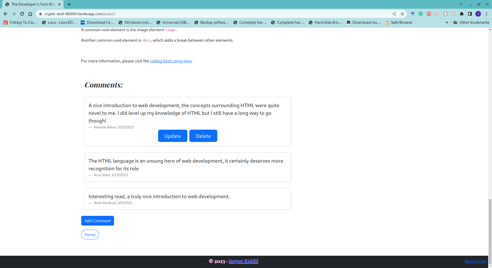
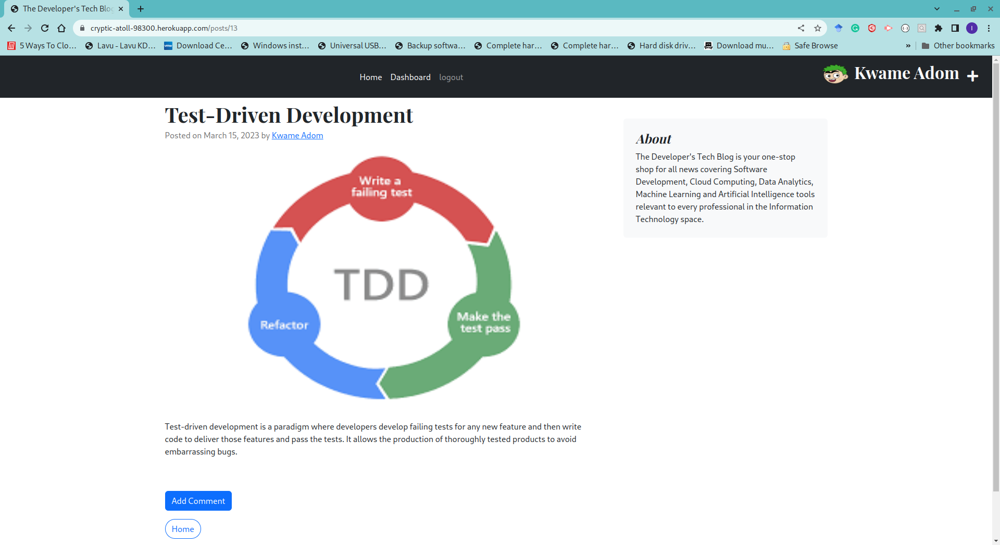

# MVC-TECH-BlOG


       

## Description

This project uses the MVC architectural structure with Handlebars, Sequelize, and Express-session to create a fullstack CMS-style blog site similar to a Wordpress site. The application allows developers to publish their blog posts and comment on other developers’ posts as well. It allows developer to share knowledge about technical concepts, recent advancements, and new technologies. It uses the MVC paradigm architectural structure together with Handlebars.js as its templating language, Sequelize as the ORM, and express-session npm package for auThentication.


My objectives for this application is based on the following user story and acceptance criteria;

### User Story

```
As a developer who writes about tech
I want a CMS-style blog site
So that I can publish articles, blog posts, and my thoughts and opinions.

```

### Acceptance Criteria

```
Given a CMS-style blog site

When I visit the site for the first time
Then I am presented with the homepage, which includes existing blog posts if any have been posted; navigation links for the homepage and the dashboard; and the option to log in
When I click on the homepage option
Then I am taken to the homepage
When I click on any other links in the navigation
Then I am prompted to either sign up or sign in
When I choose to sign up
Then I am prompted to create a username and password
When I click on the sign-up button
Then my user credentials are saved and I am logged into the site
When I revisit the site at a later time and choose to sign in
Then I am prompted to enter my username and password
When I am signed in to the site
Then I see navigation links for the homepage, the dashboard, and the option to log out
When I click on the homepage option in the navigation
Then I am taken to the homepage and presented with existing blog posts that include the post title and the date created
When I click on an existing blog post
Then I am presented with the post title, contents, post creator’s username, and date created for that post and have the option to leave a comment
When I enter a comment and click on the submit button while signed in
Then the comment is saved and the post is updated to display the comment, the comment creator’s username, and the date created
When I click on the dashboard option in the navigation
Then I am taken to the dashboard and presented with any blog posts I have already created and the option to add a new blog post
When I click on the button to add a new blog post
Then I am prompted to enter both a title and contents for my blog post
When I click on the button to create a new blog post
Then the title and contents of my post are saved and I am taken back to an updated dashboard with my new blog post
When I click on one of my existing posts in the dashboard
Then I am able to delete or update my post and taken back to an updated dashboard
When I click on the logout option in the navigation
Then I am signed out of the site
When I am idle on the site for more than a set time
Then I am able to view comments but I am prompted to log in again before I can add, update, or delete comments

```

## Table of Contents

- [Description](#description)
- [Installation](#installation)
- [Usage](#usage)
- [Questions](#questions)
- [License](#license)

---

## Installation

To run setup the backend of the application, you will need to install Node.js and once installed, you will run the following command in the root directory of the application:

- npm install

This command will install all dependencies found in the package.json file required by the application to execute. Once installed, you will navigate to the ./db directory and connect to the MySQL server using your username and password. Once connected, you will create your database with the command below and exit:

- source schema.sql; quit;

With the database created, you can connect to the database using your credentials stored in the environment variable file and use Sequelize to seed the database with the command below in the application's root directory;

- npm run seed

With the database seeded, you are ready to start the server for the application. You wil start the server with the command below:

- npm start

Once the server is running, you can connect to it locally on the port used in the server file.

## Usage

Use the Heroku link for the MVC-TECH-BLOG at https://cryptic-atoll-98300.herokuapp.com/ to visit and start using the website. 
Once on the [page](https://cryptic-atoll-98300.herokuapp.com/) it will present a homepage with a carousal displaying all the blogs on the page as indicated below. Clicking on any of the pages sends you to the post.


If you scroll down, the page presents all the blogs in rows with three at a time. 
You can also click any of the cards to visit the blog post. 


The page below shows a blog post as presented to a visitor who's not logged in. The user can read the blog and comments but cannot add any comments.


When not logged in, the user can read any blog and comments but cannot add any comments or post a blog.


Clicking on any other navigation link aside from the home link sends the user to the log-in/sign-up page.


Once the user provides their log-in credentials, then the application opens the user's dashboard. The dashboard shows all the blogs posted by the user. It also allows the user to edit, delete, or view their previous post. The navbar also displays the user's profile picture.


If the user who's logged in visits any posts, they have the option to add a comment, update a previous comment by them or delete the comment.



When the user attempts to add or update a comment, the application presents a modal to fulfill the request. 


The user can add a new blog by either clicking the plus(+) icon in the navbar or start typing in the title text area. The user can optionally add an image that depicts the message of the blog. 


When the user completes composing the blog post, the user will click the save icon in the navbar to save and post the blog. The newly created blog will appear in the list of posted blogs in the user's dashboard.


Clicking on the newly posted blog sends the user to the blog post page. The user may add a comment to the blog.



The user can delete a posted blog in the dashboard and the dashboard will update its view to remove the deleted blog.


## Questions

If you have any questions, please feel free to reach out to me at: [ikubiti@icloud.com](mailto:ikubiti@icloud.com).

Alternatively, you may find me on GitHub at [https://github.com/ikubiti](https://github.com/ikubiti).

---

## License

Copyright (c) ikubiti. All rights reserved.

Licensed under the [MIT](./LICENSE) license.